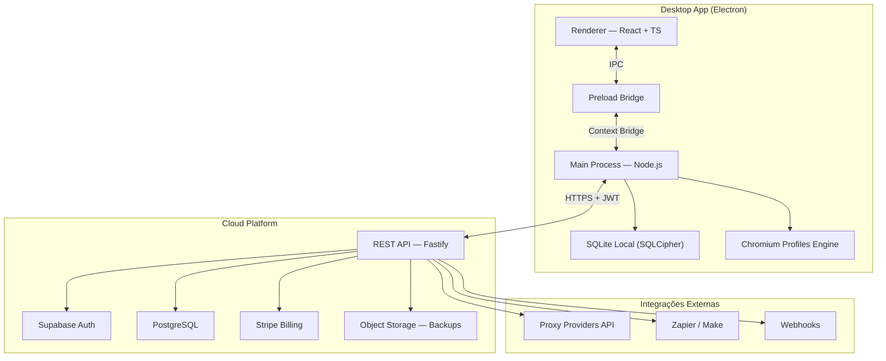
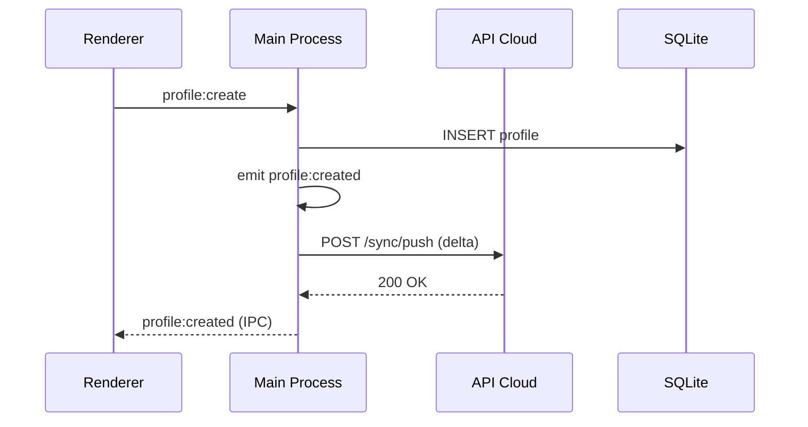
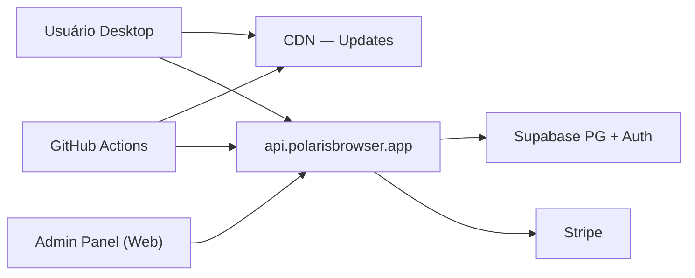

# 1. Arquitetura Completa — Polaris Browser

## Visão Geral

O Polaris Browser segue uma arquitetura **modular em monorepo**, com separação clara entre camadas desktop (Electron), API cloud, e serviços compartilhados.



## Camadas da Aplicação

### 1. Renderer Process (Frontend)

| Responsabilidade | Tecnologia |
|------------------|------------|
| UI/UX | React 19 + TypeScript strict |
| Componentes | shadcn/ui + Radix UI |
| Estilização | Tailwind CSS + CSS Variables (tokens) |
| Estado global | Zustand |
| Server state | TanStack Query |
| Roteamento | React Router v7 |
| Formulários | React Hook Form + Zod |
| Tooltips | Radix Tooltip (obrigatório em toda ação) |
| Temas | next-themes (Dark/Light) |
| i18n | i18next (pt-BR, en-US) |

### 2. Preload Script

- Ponte segura entre Renderer e Main via `contextBridge`
- Expõe APIs tipadas: `window.polaris.profiles`, `window.polaris.proxy`, etc.
- Nunca expõe `require`, `fs` ou `process` diretamente

### 3. Main Process (Backend Local)

| Módulo | Função |
|--------|--------|
| `ProfileManager` | CRUD de perfis Chromium isolados |
| `BrowserLauncher` | Spawn de instâncias com flags customizadas |
| `ProxyManager` | Pool, rotação, teste de latência |
| `SyncEngine` | Delta sync com cloud (CRDT-like) |
| `LicenseValidator` | Verificação online de licença |
| `UpdateManager` | electron-updater |
| `TelemetryService` | Opt-in, anonimizado |
| `CryptoService` | AES-256 para dados sensíveis |
| `SchedulerService` | Cron jobs locais (automação) |
| `MonitorService` | CPU, RAM, perfis ativos |

### 4. API Cloud (Backend Remoto)

| Módulo | Função |
|--------|--------|
| `AuthModule` | JWT, refresh tokens, OAuth |
| `WorkspaceModule` | Multi-tenant, convites, permissões |
| `SubscriptionModule` | Stripe webhooks, planos, limites |
| `SyncModule` | Backup, versionamento, conflitos |
| `WebhookModule` | Eventos outbound |
| `AdminModule` | Dashboard SaaS interno |
| `AuditModule` | Logs imutáveis de auditoria |

## Padrões Arquiteturais

### Modular Monolith (Desktop + API)

Cada domínio é um módulo independente com:

```
module/
├── domain/       # Entidades e regras de negócio
├── application/  # Use cases / services
├── infrastructure/ # Repositórios, adapters
└── presentation/ # Controllers, IPC handlers, React pages
```

### Event-Driven (Interno)



### Sync Strategy (Offline-First)

1. Todas as operações gravam primeiro no SQLite local
2. Fila de sync (`sync_queue`) processa deltas em background
3. Resolução de conflitos: **Last-Write-Wins** com timestamp + device_id
4. Snapshots versionados no PostgreSQL para rollback

## Segurança (OWASP)

| Ameaça | Mitigação |
|--------|-----------|
| Injection | Prepared statements (Drizzle ORM), Zod validation |
| Broken Auth | JWT curto + refresh rotation, Supabase Auth |
| Sensitive Data | SQLCipher, AES-256, TLS 1.3 |
| XXE/Deserialization | JSON only, schema validation |
| Broken Access Control | RBAC por workspace, row-level security (PG) |
| Security Misconfiguration | CSP no Electron, sandbox renderer |
| XSS | React auto-escape, DOMPurify para rich text |
| Insecure Deserialization | Protobuf/JSON tipado, sem eval |
| Insufficient Logging | Audit trail imutável |
| SSRF | Whitelist de URLs em proxy/webhook |

## Electron Security Hardening

```typescript
// BrowserWindow config
{
  webPreferences: {
    preload: path.join(__dirname, 'preload.js'),
    contextIsolation: true,
    nodeIntegration: false,
    sandbox: true,
    webSecurity: true,
  }
}
```

## Infraestrutura Cloud

| Serviço | Provedor sugerido |
|---------|-------------------|
| API Hosting | Railway / Fly.io |
| PostgreSQL | Supabase |
| Auth | Supabase Auth |
| Object Storage | Supabase Storage / S3 |
| CDN Updates | Cloudflare R2 + CDN |
| Pagamentos | Stripe |
| Email transacional | Resend |
| Monitoramento | Sentry + PostHog (opt-in) |

## Diagrama de Deploy



## Limites por Plano (Enforcement)

| Recurso | Starter | Unlimited |
|---------|---------|-----------|
| Perfis ativos | 10 | ∞ |
| Membros workspace | 3 | 20 |
| Proxies no pool | 5 | 100 |
| Sync devices | 2 | 5 |
| Webhooks | 1 | 10 |
| API rate limit | 100/min | 1000/min |

Enforcement em duas camadas: **local (LicenseValidator)** + **cloud (API middleware)**.
