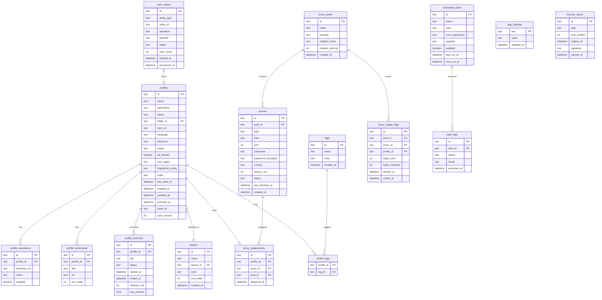
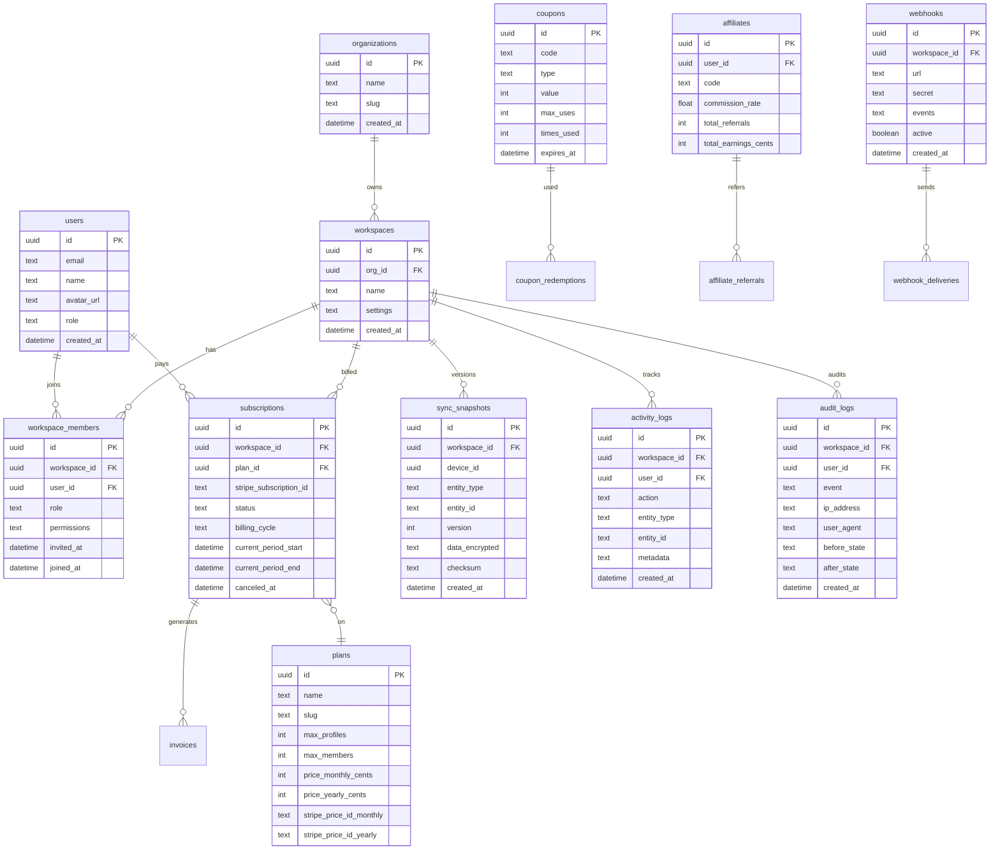

# 3. Banco de Dados — Polaris Browser

## Estratégia Dual-Database

| Banco | Uso | ORM |
|-------|-----|-----|
| **SQLite** (SQLCipher) | Dados locais, offline-first | Drizzle ORM |
| **PostgreSQL** | Sync cloud, multi-tenant, billing | Drizzle ORM + Supabase RLS |

---

## SQLite Local (Desktop)

### Diagrama ER



### DDL SQLite (Principais Tabelas)

```sql
-- Perfis de navegação
CREATE TABLE profiles (
    id              TEXT PRIMARY KEY,
    name            TEXT NOT NULL,
    description     TEXT,
    status          TEXT NOT NULL DEFAULT 'idle'
                    CHECK(status IN ('idle','running','archived')),
    folder_id       TEXT REFERENCES folders(id) ON DELETE SET NULL,
    start_url       TEXT DEFAULT 'about:blank',
    language        TEXT DEFAULT 'pt-BR',
    timezone        TEXT DEFAULT 'America/Sao_Paulo',
    locale          TEXT DEFAULT 'pt-BR',
    ad_blocker      INTEGER NOT NULL DEFAULT 0,
    user_agent      TEXT,
    fingerprint_config TEXT,  -- JSON criptografado
    notes           TEXT,
    last_used_at    TEXT,
    created_at      TEXT NOT NULL DEFAULT (datetime('now')),
    updated_at      TEXT NOT NULL DEFAULT (datetime('now')),
    archived_at     TEXT,
    cloud_id        TEXT,
    sync_version    INTEGER NOT NULL DEFAULT 1
);

CREATE INDEX idx_profiles_status ON profiles(status);
CREATE INDEX idx_profiles_folder ON profiles(folder_id);
CREATE INDEX idx_profiles_last_used ON profiles(last_used_at);

-- Fila de sincronização
CREATE TABLE sync_queue (
    id              TEXT PRIMARY KEY,
    entity_type     TEXT NOT NULL,
    entity_id       TEXT NOT NULL,
    operation       TEXT NOT NULL CHECK(operation IN ('create','update','delete')),
    payload         TEXT NOT NULL,  -- JSON
    status          TEXT NOT NULL DEFAULT 'pending'
                    CHECK(status IN ('pending','processing','done','failed')),
    retry_count     INTEGER NOT NULL DEFAULT 0,
    created_at      TEXT NOT NULL DEFAULT (datetime('now')),
    processed_at    TEXT
);

CREATE INDEX idx_sync_queue_status ON sync_queue(status);
```

---

## PostgreSQL Cloud

### Diagrama ER



### Row-Level Security (Supabase)

```sql
-- Membros só veem dados do seu workspace
ALTER TABLE workspaces ENABLE ROW LEVEL SECURITY;

CREATE POLICY workspace_isolation ON workspaces
    FOR ALL USING (
        id IN (
            SELECT workspace_id FROM workspace_members
            WHERE user_id = auth.uid()
        )
    );

-- Audit logs são append-only
CREATE POLICY audit_read_only ON audit_logs
    FOR SELECT USING (
        workspace_id IN (
            SELECT workspace_id FROM workspace_members
            WHERE user_id = auth.uid() AND role IN ('owner','admin')
        )
    );
```

### Planos Seed

```sql
INSERT INTO plans (id, name, slug, max_profiles, max_members, price_monthly_cents, price_yearly_cents) VALUES
    ('plan_starter',   'Starter',   'starter',   10,  3,  2990, 1990),
    ('plan_unlimited', 'Unlimited', 'unlimited', -1, 20,  4990, 3990);
```

---

## Estratégia de Sync

| Campo | Local (SQLite) | Cloud (PG) |
|-------|----------------|------------|
| Perfis | Fonte primária offline | Snapshot versionado |
| Proxies | Local only (segurança) | Não sincroniza credenciais |
| Settings | Merge por campo | Workspace-level defaults |
| Tags/Folders | Bidirectional sync | Sim |
| Sessions | Local only | Não |
| Audit | Push to cloud | Fonte de verdade |

### Fluxo de Conflito

```
1. Device A edita profile X → sync_version = 5
2. Device B edita profile X offline → sync_version = 5
3. Device A sync first → cloud version = 6
4. Device B sync → conflito detectado (version mismatch)
5. UI apresenta: "Manter local" | "Usar cloud" | "Mesclar"
```

---

## Índices de Performance

```sql
-- PostgreSQL
CREATE INDEX idx_activity_logs_workspace_date ON activity_logs(workspace_id, created_at DESC);
CREATE INDEX idx_sync_snapshots_lookup ON sync_snapshots(workspace_id, entity_type, entity_id, version DESC);
CREATE INDEX idx_subscriptions_status ON subscriptions(status) WHERE status = 'active';
CREATE INDEX idx_audit_logs_workspace ON audit_logs(workspace_id, created_at DESC);
```

## Backup e Retenção

| Tipo | Frequência | Retenção |
|------|------------|----------|
| Sync snapshot | A cada sync | 30 versões por entidade |
| Full workspace backup | Diário | 90 dias |
| Audit logs | Contínuo | 2 anos (LGPD) |
| Local SQLite | A cada alteração | WAL mode + auto-vacuum |
