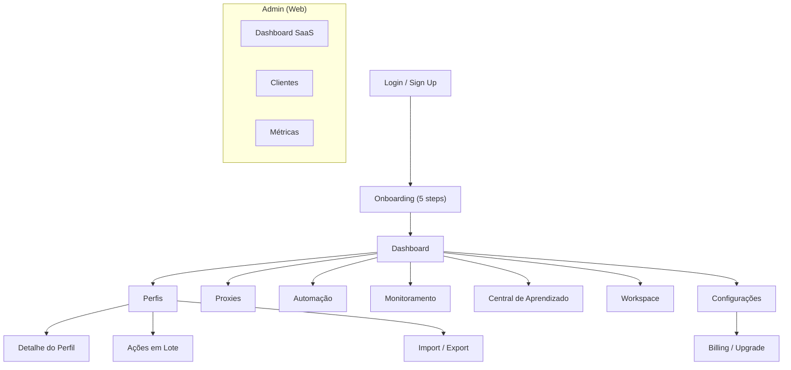

# 4. Wireframes — Polaris Browser

> Wireframes ASCII de baixa fidelidade. Estilo visual: sidebar fixa + content area (Linear/Arc/Notion).

---

## Layout Global (App Shell)

```
┌──────────────────────────────────────────────────────────────────────────┐
│ ● ● ●  Polaris Browser                              🔍  ⌘K  🌙  👤 ▾  │
├────────────┬─────────────────────────────────────────────────────────────┤
│            │                                                             │
│  ✦ Dashboard│                    CONTENT AREA                            │
│            │                                                             │
│  ◉ Perfis  │                                                             │
│  ◇ Proxies │                                                             │
│  ◇ Auto    │                                                             │
│  ◇ Monitor │                                                             │
│  ◇ Learn   │                                                             │
│            │                                                             │
│  ──────────│                                                             │
│  ◇ Workspace│                                                            │
│  ◇ Settings│                                                             │
│            │                                                             │
│  ──────────│                                                             │
│  [Starter] │                                                             │
│  7/10 perfis│                                                            │
│  [Upgrade] │                                                             │
└────────────┴─────────────────────────────────────────────────────────────┘
```

**Sidebar:** 240px expandida / 64px colapsada  
**Header:** 48px — busca global (⌘K), toggle tema, avatar  
**Tooltips:** hover em todo ícone/botão da sidebar

---

## Dashboard

```
┌─────────────────────────────────────────────────────────────────────────┐
│ Dashboard                                                    [+ Perfil] │
│ Bem-vindo de volta, Ana 👋                                              │
├─────────────────────────────────────────────────────────────────────────┤
│                                                                         │
│  ┌─────────────┐ ┌─────────────┐ ┌─────────────┐ ┌─────────────┐     │
│  │ 7           │ │ 2           │ │ 5           │ │ 142ms       │     │
│  │ Perfis      │ │ Ativos      │ │ Inativos    │ │ Latência    │     │
│  │ totais      │ │ agora       │ │ >7 dias     │ │ média proxy │     │
│  └─────────────┘ └─────────────┘ └─────────────┘ └─────────────┘     │
│                                                                         │
│  Perfis Recentes                                    Ver todos →         │
│  ┌──────────────────────────────────────────────────────────────────┐ │
│  │ 🟢 Loja Principal    │ E-commerce │ Proxy BR │ há 2 min  │ ▶ Launch│ │
│  │ 🟢 Suporte N1        │ Suporte    │ Proxy US │ há 15 min │ ▶ Launch│ │
│  │ ⚪ QA Staging        │ QA         │ —        │ há 3 dias │ ▶ Launch│ │
│  └──────────────────────────────────────────────────────────────────┘ │
│                                                                         │
│  Uso de Recursos                                                        │
│  ┌──────────────────────────────────────────────────────────────────┐ │
│  │ CPU  ████████░░░░░░░░░░  34%                                     │ │
│  │ RAM  ██████████░░░░░░░░  52%   (2.1 GB / 4 GB alocado)          │ │
│  └──────────────────────────────────────────────────────────────────┘ │
│                                                                         │
│  Atividade Recente                                                      │
│  • Ana criou perfil "Campanha Black Friday" — há 1h                    │
│  • Proxy pool "BR Residential" testado — 8/10 online — há 2h           │
│  • Sync concluído com sucesso — há 3h                                  │
└─────────────────────────────────────────────────────────────────────────┘
```

---

## Lista de Perfis

```
┌─────────────────────────────────────────────────────────────────────────┐
│ Perfis                    [Importar] [Exportar] [Ações em lote ▾] [+ Novo]│
├─────────────────────────────────────────────────────────────────────────┤
│ 🔍 Buscar perfis...          Filtros: [Status ▾] [Tags ▾] [Pasta ▾]   │
├────────────┬────────────────────────────────────────────────────────────┤
│ Pastas     │  ☐  Nome              Status   Tags      Proxy    Último uso│
│            │  ─────────────────────────────────────────────────────────── │
│ 📁 Todos   │  ☐  Loja Principal    🟢 Ativo  shop,br  BR-01   2 min    │
│ 📁 E-comm  │  ☐  Suporte N1        🟢 Ativo  support   US-02   15 min   │
│ 📁 QA      │  ☐  QA Staging        ⚪ Idle   qa        —       3 dias   │
│ 📁 Marketing│ ☐  Ads Meta           🟢 Ativo  ads,meta  BR-03   1h       │
│            │  ☐  Campanha BF       ⚪ Idle   campaign  BR-01   nunca     │
│ + Nova pasta│                                                          │
│            │  Mostrando 5 de 7 perfis              ◀ 1 ▶               │
└────────────┴────────────────────────────────────────────────────────────┘
```

---

## Detalhe do Perfil (Drawer lateral)

```
                                    ┌──────────────────────────────┐
                                    │ Loja Principal          ✕    │
                                    │ ──────────────────────────── │
                                    │ Status: 🟢 Ativo             │
                                    │                              │
                                    │ [▶ Launch]  [⎘ Duplicar]    │
                                    │ [📦 Exportar] [🗄 Arquivar]  │
                                    │                              │
                                    │ ── Configurações ──          │
                                    │ URL inicial                  │
                                    │ [https://loja.exemplo.com  ] │
                                    │                              │
                                    │ Idioma        Fuso horário   │
                                    │ [pt-BR ▾]     [São Paulo ▾] │
                                    │                              │
                                    │ ☑ Bloqueador de anúncios    │
                                    │                              │
                                    │ ── Proxy ──                  │
                                    │ Pool: BR Residential [▾]    │
                                    │ Proxy: 189.x.x.x:8080       │
                                    │ Latência: 142ms ✅          │
                                    │                              │
                                    │ ── Tags ──                   │
                                    │ [shop] [br] [+ tag]         │
                                    │                              │
                                    │ ── Extensões ──              │
                                    │ ☑ uBlock Origin              │
                                    │ ☐ LastPass                   │
                                    │                              │
                                    │ [Salvar alterações]          │
                                    └──────────────────────────────┘
```

---

## Gestão de Proxies

```
┌─────────────────────────────────────────────────────────────────────────┐
│ Proxies                                              [+ Pool] [+ Proxy] │
├─────────────────────────────────────────────────────────────────────────┤
│ Pools                                                                   │
│ ┌─────────────────────────────────────────────────────────────────────┐ │
│ │ Pool              Tipo     Proxies  Online  Latência  Rotação  Ações│ │
│ │ BR Residential    SOCKS5   10       8/10    142ms    Round-robin ▾  │ │
│ │ US Datacenter     HTTP     5        5/5     89ms     Sticky       ▾  │ │
│ └─────────────────────────────────────────────────────────────────────┘ │
│                                                                         │
│ Consumo do Mês                                                          │
│ ┌─────────────────────────────────────────────────────────────────────┐ │
│ │ ████████████████████░░░░░░░░  2.4 GB / 10 GB                       │ │
│ └─────────────────────────────────────────────────────────────────────┘ │
│                                                                         │
│ Detalhe: BR Residential                                                 │
│ ┌─────────────────────────────────────────────────────────────────────┐ │
│ │ Host           Port  Tipo    País  Latência  Status    Perfil      │ │
│ │ 189.1.2.3      8080  SOCKS5  BR    120ms    ✅ Online  Loja Princ. │ │
│ │ 189.1.2.4      8080  SOCKS5  BR    165ms    ✅ Online  Ads Meta    │ │
│ │ 189.1.2.5      8080  SOCKS5  BR    —        ❌ Offline —           │ │
│ └─────────────────────────────────────────────────────────────────────┘ │
│                                              [Testar todos] [Importar]  │
└─────────────────────────────────────────────────────────────────────────┘
```

---

## Ações em Lote

```
┌─────────────────────────────────────────────────────────────────────────┐
│ Ações em Lote — 3 perfis selecionados                                   │
├─────────────────────────────────────────────────────────────────────────┤
│                                                                         │
│  Ação:  ◉ Aplicar configurações   ○ Mover para pasta   ○ Excluir       │
│                                                                         │
│  ┌─ Configurações a aplicar ─────────────────────────────────────────┐│
│  │ ☐ URL inicial:     [                              ]               ││
│  │ ☐ Idioma:           [pt-BR ▾]                                     ││
│  │ ☐ Fuso horário:     [America/Sao_Paulo ▾]                         ││
│  │ ☐ Proxy pool:       [BR Residential ▾]                            ││
│  │ ☐ Bloqueador ads:   [Ativar ▾]                                    ││
│  │ ☐ Tags (adicionar): [                    ] [+ Adicionar]           ││
│  └─────────────────────────────────────────────────────────────────────┘│
│                                                                         │
│  Preview: 3 perfis serão atualizados                                   │
│  • Loja Principal, Suporte N1, Ads Meta                                │
│                                                                         │
│                              [Cancelar]  [Aplicar a 3 perfis]          │
└─────────────────────────────────────────────────────────────────────────┘
```

---

## Workspace (Equipe)

```
┌─────────────────────────────────────────────────────────────────────────┐
│ Workspace — Agência Digital XYZ                    [Convidar membro]    │
├─────────────────────────────────────────────────────────────────────────┤
│ Membros (3/3 no plano Starter)                                          │
│ ┌─────────────────────────────────────────────────────────────────────┐ │
│ │ Avatar  Nome           Email                  Role       Ações      │ │
│ │ 👤      Ana Silva      ana@agencia.com        Owner      —          │ │
│ │ 👤      Bruno Costa    bruno@agencia.com      Admin      ▾          │ │
│ │ 👤      Carla Dias     carla@agencia.com      Member     ▾          │ │
│ └─────────────────────────────────────────────────────────────────────┘ │
│                                                                         │
│ Permissões por Role                                                     │
│ ┌──────────────┬───────┬───────┬────────┬────────┐                   │
│ │ Permissão    │ Owner │ Admin │ Member │ Viewer │                   │
│ │ Criar perfil │  ✅   │  ✅   │   ✅   │   ❌   │                   │
│ │ Launch perfil│  ✅   │  ✅   │   ✅   │   ❌   │                   │
│ │ Gerir proxy  │  ✅   │  ✅   │   ❌   │   ❌   │                   │
│ │ Convidar     │  ✅   │  ✅   │   ❌   │   ❌   │                   │
│ │ Billing      │  ✅   │  ❌   │   ❌   │   ❌   │                   │
│ └──────────────┴───────┴───────┴────────┴────────┘                   │
│                                                                         │
│ Logs de Atividade                              [Exportar CSV]           │
│ • Bruno editou proxy pool "US Datacenter" — 14/06 10:32               │
│ • Carla launch perfil "QA Staging" — 14/06 09:15                      │
└─────────────────────────────────────────────────────────────────────────┘
```

---

## Automação

```
┌─────────────────────────────────────────────────────────────────────────┐
│ Automação                                    [+ Tarefa] [+ Webhook]     │
├─────────────────────────────────────────────────────────────────────────┤
│ Tarefas Agendadas                                                       │
│ ┌─────────────────────────────────────────────────────────────────────┐ │
│ │ Nome                  Tipo              Cron          Status  Ações │ │
│ │ Abrir perfis manhã    Launch múltiplo   0 8 * * 1-5  ✅ Ativo  ▾   │ │
│ │ Testar proxies        Health check      0 */6 * * *  ✅ Ativo  ▾   │ │
│ │ Backup semanal        Sync forçado      0 2 * * 0    ✅ Ativo  ▾   │ │
│ └─────────────────────────────────────────────────────────────────────┘ │
│                                                                         │
│ Webhooks                                                                │
│ ┌─────────────────────────────────────────────────────────────────────┐ │
│ │ URL                              Eventos              Status        │ │
│ │ https://hooks.zapier.com/...     profile.launched     ✅ Ativo     │ │
│ │ https://hook.make.com/...        proxy.offline        ⏸ Pausado    │ │
│ └─────────────────────────────────────────────────────────────────────┘ │
│                                                                         │
│ API Key: pk_live_••••••••••••••••          [Regenerar] [Documentação]│
└─────────────────────────────────────────────────────────────────────────┘
```

---

## Settings / Billing

```
┌─────────────────────────────────────────────────────────────────────────┐
│ Configurações                                                           │
├──────────────────┬──────────────────────────────────────────────────────┤
│ Geral            │  Plano Atual: Starter                                │
│ Aparência        │  ┌────────────────────────────────────────────────┐│
│ Sincronização    │  │ Starter — R$ 29,90/mês                          ││
│ Notificações     │  │ 7 de 10 perfis ativos                           ││
│ Segurança        │  │ 3 de 3 membros                                  ││
│ Billing  ◉       │  │ Próxima cobrança: 15/07/2026                    ││
│ Sobre            │  │                    [Upgrade para Unlimited]      ││
│                  │  └────────────────────────────────────────────────┘│
│                  │                                                      │
│                  │  Comparar Planos                                     │
│                  │  ┌──────────────┐  ┌──────────────┐                 │
│                  │  │ Starter      │  │ Unlimited ⭐  │                 │
│                  │  │ R$ 29,90/mês │  │ R$ 49,90/mês │                 │
│                  │  │ 10 perfis    │  │ ∞ perfis     │                 │
│                  │  │ 3 membros    │  │ 20 membros   │                 │
│                  │  │ [Atual]      │  │ [Upgrade]    │                 │
│                  │  └──────────────┘  └──────────────┘                 │
└──────────────────┴──────────────────────────────────────────────────────┘
```

---

## Admin Panel (Web)

```
┌─────────────────────────────────────────────────────────────────────────┐
│ Polaris Admin                                              admin@polaris │
├────────────┬────────────────────────────────────────────────────────────┤
│ Dashboard  │  MRR: R$ 42.850    Clientes: 312    Churn: 3.2%          │
│ Clientes   │                                                            │
│ Assinaturas│  ┌─────────┐ ┌─────────┐ ┌─────────┐ ┌─────────┐       │
│ Pagamentos │  │ +28     │ │ 312     │ │ 3.2%    │ │ R$ 42k  │       │
│ Cupons     │  │ Novos   │ │ Ativos  │ │ Churn   │ │ MRR     │       │
│ Afiliados  │  │ (30d)   │ │         │ │ (30d)   │ │         │       │
│ Métricas   │  └─────────┘ └─────────┘ └─────────┘ └─────────┘       │
│            │                                                            │
│            │  Receita (12 meses)                                        │
│            │  ┌────────────────────────────────────────────────────┐  │
│            │  │     📈 Gráfico de linha — MRR crescente            │  │
│            │  └────────────────────────────────────────────────────┘  │
│            │                                                            │
│            │  Últimas Assinaturas                                       │
│            │  Agência XYZ → Unlimited (anual) — R$ 478,80 — há 2h    │
│            │  Loja ABC → Starter (mensal) — R$ 29,90 — há 5h          │
└────────────┴────────────────────────────────────────────────────────────┘
```

---

## Mapa de Navegação


