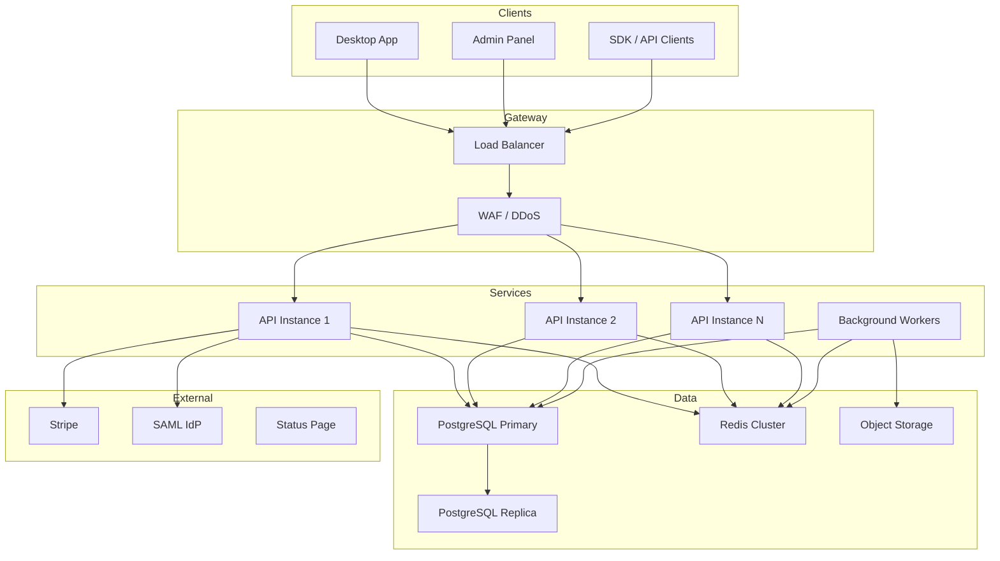

# 7. Roadmap Enterprise — Polaris Browser

**Duração:** 20 semanas (5 meses) pós-V2  
**Objetivo:** Plataforma SaaS completa com admin panel, compliance enterprise e escala.

---

## Novo Plano: Enterprise

| Recurso | Starter | Unlimited | Enterprise |
|---------|---------|-----------|------------|
| Perfis | 10 | ∞ | ∞ |
| Membros | 3 | 20 | ∞ |
| Proxies | 5 | 100 | ∞ |
| Devices sync | 2 | 5 | ∞ |
| Webhooks | 1 | 10 | ∞ |
| API rate | 100/min | 1000/min | 10000/min |
| SSO/SAML | ❌ | ❌ | ✅ |
| SLA | — | — | 99.9% |
| Suporte | Email | Priority | Dedicated CSM |
| Preço | R$29,90/m | R$49,90/m | Custom |

---

## Timeline Enterprise

### Fase 1: Admin Panel (Semanas 1–8)

#### Sprint 17–18: Admin Core

| Entrega | Detalhe |
|---------|---------|
| Admin web app | React SPA separada (`apps/admin`) |
| Auth admin | Role super-admin, 2FA obrigatório |
| Dashboard SaaS | MRR, ARR, clientes, churn, novos |
| Gestão clientes | List, search, detail, impersonate |
| Gestão assinaturas | View, manual upgrade/downgrade, cancel |
| Gestão pagamentos | Faturas Stripe, reembolsos, disputas |

#### Sprint 19–20: Revenue Operations

| Entrega | Detalhe |
|---------|---------|
| Cupons | CRUD: % off, fixed, trial extension, max uses |
| Afiliados | Código, comissão recorrente, dashboard afiliado |
| Métricas SaaS | MRR trend, cohort retention, LTV, CAC |
| Churn analysis | Reasons, win-back campaigns |
| Revenue reports | Export CSV/PDF, filtros por período |
| Dunning | Emails automáticos para pagamento falho |

**Marco:** Admin visualiza MRR real-time com dados Stripe.

---

### Fase 2: Enterprise Features (Semanas 9–16)

#### Sprint 21–22: SSO + Compliance

| Entrega | Detalhe |
|---------|---------|
| SAML 2.0 | Okta, Azure AD, Google Workspace |
| SCIM provisioning | Auto-create/deactivate users |
| IP whitelist | Restringir acesso admin/API por IP |
| Data residency | Opção EU/US server region |
| LGPD compliance | Exportação completa, direito ao esquecimento |
| GDPR compliance | DPA template, cookie consent |
| Audit export | CSV/JSON de audit logs com retenção 2 anos |
| Encryption at rest | PostgreSQL TDE + field-level encryption |

#### Sprint 23–24: Scale + Reliability

| Entrega | Detalhe |
|---------|---------|
| Multi-region API | Deploy US + EU (Fly.io) |
| Redis cache | Session, rate limit, proxy health cache |
| Queue system | BullMQ para sync, webhooks, emails |
| Horizontal scaling | API stateless, auto-scale |
| SLA monitoring | Uptime 99.9%, status page pública |
| Disaster recovery | RPO 1h, RTO 4h, backup cross-region |
| Load testing | 10k concurrent users, 100k profiles sync |

**Marco:** API sustenta 10k req/min sem degradação.

---

### Fase 3: Advanced Platform (Semanas 17–20)

#### Sprint 25–26: Advanced Admin + Analytics

| Entrega | Detalhe |
|---------|---------|
| Cohort analysis | Retention curves por signup month |
| Feature flags | LaunchDarkly/similar para rollouts graduais |
| A/B testing | Pricing page, onboarding variants |
| Usage analytics | Feature adoption heatmap |
| Customer health score | Composto: login, perfis, sync, support |
| Automated alerts | Churn risk, usage drop, payment fail |
| White-label (future) | Logo + cores customizáveis por org |

#### Sprint 27–28: Ecosystem

| Entrega | Detalhe |
|---------|---------|
| Public API v2 | GraphQL option, batch endpoints |
| SDK JavaScript | `@polaris-browser/sdk` npm package |
| SDK Python | `polaris-browser` pip package |
| Marketplace | Templates de perfil pré-configurados |
| Plugin system | Extensões de terceiros (future) |
| Partner program | Revenda, implementação, certificação |

**Marco:** SDK publicado no npm com 100 downloads/semana.

---

## Arquitetura Enterprise

---

## Critérios de Aceite Enterprise

| # | Critério |
|---|----------|
| 1 | Admin gerencia 1000+ clientes sem lag |
| 2 | SSO login via Okta funcional |
| 3 | SCIM auto-provisiona usuário em < 30s |
| 4 | API sustenta 10k req/min (p99 < 500ms) |
| 5 | Uptime 99.9% por 30 dias consecutivos |
| 6 | LGPD export completo em < 24h |
| 7 | Afiliado recebe comissão recorrente automática |
| 8 | Churn dashboard identifica top 3 reasons |

---

## KPIs Enterprise (90 dias pós-release)

| Métrica | Target |
|---------|--------|
| Enterprise customers | 10 |
| Enterprise MRR | R$ 15.000 |
| Admin panel daily active | 100% ops team |
| API uptime | 99.9% |
| Support SLA (Enterprise) | < 4h response |
| Affiliate revenue | 10% of new MRR |
| Churn (Enterprise) | < 2%/month |

---

## Investimento Estimado Enterprise

| Item | Custo mensal |
|------|-------------|
| Infra (multi-region) | R$ 3.000 |
| Stripe fees (2.9%) | Variável |
| Status page (Better Stack) | R$ 200 |
| Email (Resend) | R$ 100 |
| Monitoring (Sentry + PostHog) | R$ 500 |
| SAML provider | R$ 0 (self-hosted) |
| Equipe adicional (2 devs) | R$ 30.000 |
| **Total fixo** | **~R$ 34.000/mês** |

Break-even Enterprise: ~7 clientes a R$ 5.000/mês custom.
