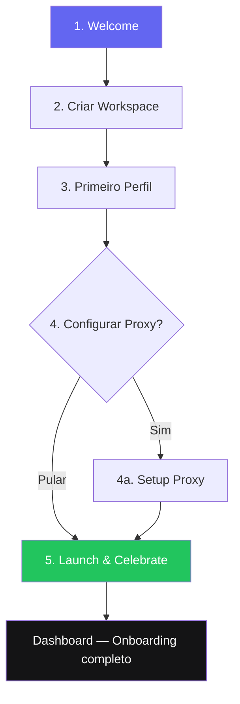

# 9. Fluxo de Onboarding — Polaris Browser

## Objetivo

Guiar novos usuários do zero ao primeiro perfil lançado em **menos de 5 minutos**, maximizando ativação e reduzindo churn precoce.

---

## Fluxo Completo



---

## Step 1: Welcome (Tela cheia)

**Duração estimada:** 15 segundos

```
┌─────────────────────────────────────────────────────────────────┐
│                                                                 │
│                    ✦ Polaris Browser                            │
│                                                                 │
│         Gerencie múltiplos perfis de navegação                  │
│         de forma profissional e segura.                         │
│                                                                 │
│    ┌─────────┐  ┌─────────┐  ┌─────────┐  ┌─────────┐         │
│    │ 🔒      │  │ 🌐      │  │ 👥      │  │ ⚡      │         │
│    │ Perfis  │  │ Proxies │  │ Equipe  │  │ Automação│         │
│    │ isolados│  │ integrados│ │ colaborativa│ │ inteligente│    │
│    └─────────┘  └─────────┘  └─────────┘  └─────────┘         │
│                                                                 │
│                   [Começar →]                                   │
│                                                                 │
│              Já tem conta? [Entrar]                             │
│                                                                 │
│         ● ○ ○ ○ ○                              Step 1 de 5     │
└─────────────────────────────────────────────────────────────────┘
```

**Elementos:**
- Logo animado (fade-in)
- 4 value props em cards
- CTA primário "Começar"
- Link secundário "Entrar"
- Progress dots (5 steps)
- Sem sidebar — tela imersiva

---

## Step 2: Criar Workspace

**Duração estimada:** 30 segundos

```
┌─────────────────────────────────────────────────────────────────┐
│                                                                 │
│              Configure seu workspace                            │
│                                                                 │
│    Nome do workspace                                            │
│    [Agência Digital XYZ                              ]          │
│    ℹ Nome da sua empresa ou equipe                             │
│                                                                 │
│    Seu nome                                                     │
│    [Ana Silva                                        ]          │
│                                                                 │
│    Tipo de uso (opcional)                                       │
│    ┌──────────┐ ┌──────────┐ ┌──────────┐ ┌──────────┐      │
│    │ Agência  │ │ E-commerce│ │ QA/Test  │ │ Outro    │      │
│    │ ◉        │ │ ○        │ │ ○        │ │ ○        │      │
│    └──────────┘ └──────────┘ └──────────┘ └──────────┘      │
│                                                                 │
│              [← Voltar]  [Continuar →]                          │
│                                                                 │
│         ● ● ○ ○ ○                              Step 2 de 5     │
└─────────────────────────────────────────────────────────────────┘
```

**Lógica:**
- Cria `organization` + `workspace` + `workspace_member` (owner)
- "Tipo de uso" salva em `workspace.settings` para personalizar dicas
- Validação: nome workspace min 2 chars

---

## Step 3: Primeiro Perfil

**Duração estimada:** 1 minuto

```
┌─────────────────────────────────────────────────────────────────┐
│                                                                 │
│              Crie seu primeiro perfil                           │
│                                                                 │
│    Nome do perfil *                                             │
│    [Meu Primeiro Perfil                              ]          │
│                                                                 │
│    URL inicial                                                  │
│    [https://google.com                               ]          │
│    ℹ Página que abrirá ao iniciar este perfil                  │
│                                                                 │
│    Pasta (opcional)                                             │
│    [Geral ▾]                                                    │
│                                                                 │
│    ┌─ Configurações rápidas ──────────────────────────────────┐│
│    │ Idioma: [pt-BR ▾]    Fuso: [São Paulo ▾]                ││
│    │ ☑ Bloqueador de anúncios                                  ││
│    └──────────────────────────────────────────────────────────┘│
│                                                                 │
│    💡 Dica: cada perfil tem cookies, cache e sessão isolados   │
│                                                                 │
│              [← Voltar]  [Criar perfil →]                       │
│                                                                 │
│         ● ● ● ○ ○                              Step 3 de 5     │
└─────────────────────────────────────────────────────────────────┘
```

**Lógica:**
- Cria perfil Chromium isolado no filesystem
- Gera `user-data-dir` único
- Salva no SQLite + enqueue sync
- Confetti sutil ao criar

---

## Step 4: Configurar Proxy (Opcional)

**Duração estimada:** 2 minutos (ou skip)

```
┌─────────────────────────────────────────────────────────────────┐
│                                                                 │
│              Deseja configurar um proxy?                        │
│                                                                 │
│    Proxies permitem que cada perfil use um IP diferente,        │
│    essencial para operações multi-conta.                        │
│                                                                 │
│    ┌─ Adicionar proxy manualmente ────────────────────────────┐│
│    │ Tipo:  ◉ HTTP  ○ HTTPS  ○ SOCKS5                        ││
│    │ Host:  [                    ]  Porta: [8080]             ││
│    │ User:  [                    ]  Senha: [••••••]           ││
│    │                                         [Testar conexão]  ││
│    └──────────────────────────────────────────────────────────┘│
│                                                                 │
│    ── ou ──                                                     │
│                                                                 │
│    [Importar lista de proxies]  [Integrar provedor ▾]           │
│                                                                 │
│              [Pular por agora]  [Salvar e continuar →]          │
│                                                                 │
│         ● ● ● ● ○                              Step 4 de 5     │
└─────────────────────────────────────────────────────────────────┘
```

**Lógica:**
- "Pular" avança sem proxy (recomendado para novos usuários)
- "Testar conexão" faz request via proxy e mostra latência/IP
- Se proxy adicionado, associa ao perfil criado no Step 3
- Tooltip em "Pular": "Você pode configurar proxies depois em Proxies"

---

## Step 5: Launch & Celebrate

**Duração estimada:** 30 segundos

```
┌─────────────────────────────────────────────────────────────────┐
│                                                                 │
│                    🎉 Tudo pronto!                              │
│                                                                 │
│         Seu perfil "Meu Primeiro Perfil" está configurado     │
│                                                                 │
│    ┌─────────────────────────────────────────────────────────┐  │
│    │                                                         │  │
│    │   Meu Primeiro Perfil                                   │  │
│    │   https://google.com                                    │  │
│    │   Idioma: pt-BR  │  Proxy: nenhum                      │  │
│    │                                                         │  │
│    │              [▶ Abrir perfil agora]                     │  │
│    │                                                         │  │
│    └─────────────────────────────────────────────────────────┘  │
│                                                                 │
│    Próximos passos sugeridos:                                   │
│    • Criar mais perfis para diferentes contas                   │
│    • Configurar proxies para IPs distintos                      │
│    • Convidar membros da equipe                                 │
│                                                                 │
│              [Ir para o Dashboard →]                            │
│                                                                 │
│         ● ● ● ● ●                              Step 5 de 5     │
└─────────────────────────────────────────────────────────────────┘
```

**Lógica:**
- "Abrir perfil agora" → launch Chromium + transição para dashboard
- "Ir para Dashboard" → marca onboarding como completo
- Salva `onboarding_completed: true` em settings
- Ativa checklist contextual no dashboard (3 items pendentes)

---

## Pós-Onboarding: Checklist Contextual

Aparece no dashboard por 7 dias ou até completar todos:

```
┌─ Comece aqui ──────────────────────────────────── 2/5 completo ─┐
│ ✅ Criar primeiro perfil                                        │
│ ✅ Completar onboarding                                         │
│ ☐ Criar 3 perfis                                                │
│ ☐ Configurar um proxy                                           │
│ ☐ Convidar um membro da equipe                                  │
│                                          [Dispensar checklist]  │
└─────────────────────────────────────────────────────────────────┘
```

---

## Métricas de Onboarding

| Métrica | Target | Medição |
|---------|--------|---------|
| Completion rate | > 70% | Step 5 reached / Step 1 started |
| Time to first profile | < 3 min | Timestamp step 3 |
| Time to first launch | < 5 min | Timestamp step 5 launch |
| Proxy skip rate | ~ 60% | Step 4 skip / total |
| D1 retention | > 40% | Return day 1 after signup |
| D7 retention | > 25% | Return day 7 |
| Checklist completion | > 50% | All 5 items done |

---

## Regras de Re-onboarding

| Cenário | Comportamento |
|---------|---------------|
| Usuário pula onboarding | Pode retomar via Settings → "Refazer tour" |
| Novo device login | Skip onboarding, sync traz dados |
| Upgrade de plano | Mini-tour de features desbloqueadas |
| Feature nova (V2+) | Tooltip spotlight na sidebar (1x) |

---

## Acessibilidade no Onboarding

- Navegação por Tab entre campos
- Enter avança step (quando form válido)
- Esc não fecha onboarding (precisa completar ou "Pular")
- Screen reader: anuncia "Step X de 5" a cada transição
- Animações respeitam `prefers-reduced-motion`
