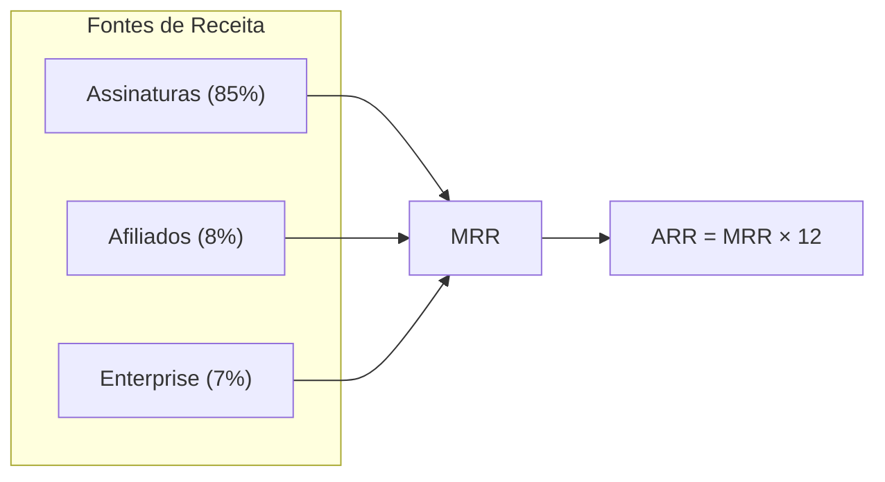

# 10. Plano de Monetização — Polaris Browser

---

## Modelo de Receita

**SaaS B2B subscription** com receita recorrente mensal (MRR) e anual (ARR).

---

## Planos e Pricing

### Starter — R$ 29,90/mês

| Atributo | Valor |
|----------|-------|
| Perfis ativos | 10 |
| Membros workspace | 3 |
| Proxies no pool | 5 |
| Devices sync | 2 |
| Webhooks | 1 |
| API rate limit | 100 req/min |
| Suporte | Email (48h SLA) |
| Anual | R$ 238,80/ano (R$ 19,90/mês — **33% off**) |

**Persona:** Freelancer, micro-agência, QA individual.

### Unlimited — R$ 49,90/mês

| Atributo | Valor |
|----------|-------|
| Perfis ativos | Ilimitados |
| Membros workspace | 20 |
| Proxies no pool | 100 |
| Devices sync | 5 |
| Webhooks | 10 |
| API rate limit | 1000 req/min |
| Suporte | Priority email (24h SLA) |
| Anual | R$ 478,80/ano (R$ 39,90/mês — **20% off**) |

**Persona:** Agência de marketing, e-commerce multi-loja, equipe QA.

### Enterprise — Custom

| Atributo | Valor |
|----------|-------|
| Tudo do Unlimited | + |
| SSO/SAML | ✅ |
| SLA 99.9% | ✅ |
| CSM dedicado | ✅ |
| IP whitelist | ✅ |
| Data residency | ✅ |
| Preço | A partir de R$ 499/mês |

**Persona:** Enterprise, operações em escala, compliance exigente.

---

## Unit Economics

### CAC (Custo de Aquisição)

| Canal | CAC estimado | % aquisição |
|-------|-------------|-------------|
| Orgânico (SEO/content) | R$ 15 | 30% |
| Paid (Google/Meta ads) | R$ 80 | 25% |
| Afiliados (20% comissão) | R$ 50 | 20% |
| Product-led (free trial) | R$ 10 | 15% |
| Parcerias B2B | R$ 120 | 10% |
| **CAC blended** | **R$ 52** | 100% |

### LTV (Lifetime Value)

| Plano | ARPU/mês | Churn/mês | Lifetime | LTV |
|-------|----------|-----------|----------|-----|
| Starter mensal | R$ 29,90 | 8% | 12.5 meses | R$ 374 |
| Starter anual | R$ 19,90 | 4% | 25 meses | R$ 498 |
| Unlimited mensal | R$ 49,90 | 5% | 20 meses | R$ 998 |
| Unlimited anual | R$ 39,90 | 3% | 33 meses | R$ 1.317 |

### LTV:CAC Ratio

| Plano | LTV | CAC | Ratio | Saúde |
|-------|-----|-----|-------|-------|
| Starter | R$ 374 | R$ 52 | **7.2x** | ✅ Excelente |
| Unlimited | R$ 998 | R$ 52 | **19.2x** | ✅ Excelente |

Target: LTV:CAC > 3x (saudável para SaaS).

---

## Projeção de Receita (12 meses)

| Mês | Starter | Unlimited | Enterprise | MRR | ARR run-rate |
|-----|---------|-----------|------------|-----|-------------|
| 1 (beta) | 15 | 5 | 0 | R$ 698 | R$ 8.376 |
| 3 | 50 | 20 | 0 | R$ 2.493 | R$ 29.916 |
| 6 | 120 | 60 | 2 | R$ 6.582 | R$ 78.984 |
| 9 | 200 | 120 | 5 | R$ 11.968 | R$ 143.616 |
| 12 | 300 | 200 | 10 | R$ 18.950 | R$ 227.400 |

**Premissas:**
- 70% Starter / 30% Unlimited mix
- 20% escolhem plano anual (desconto)
- Upgrade Starter→Unlimited: 15% em 6 meses
- Churn blended: 6%/mês (melhorando para 4%)

---

## Estratégia de Pricing

### Ancoragem

Unlimited a R$ 49,90 faz Starter a R$ 29,90 parecer acessível. A diferença de R$ 20 desbloqueia perfis ilimitados — ROI claro para quem precisa de >10 perfis.

### Desconto Anual

| Plano | Desconto anual | Motivo |
|-------|---------------|--------|
| Starter | 33% off | Incentivar commitment, reduzir churn |
| Unlimited | 20% off | Margem maior permite desconto menor |

### Upgrade Triggers (in-app)

| Trigger | Mensagem | CTA |
|---------|----------|-----|
| 8/10 perfis | "Você está usando 80% dos perfis do plano Starter" | Upgrade |
| 3/3 membros | "Limite de membros atingido" | Upgrade |
| Bulk import >10 | "Importação em massa requer Unlimited" | Upgrade |
| 5/5 proxies | "Limite de proxies atingido" | Upgrade |

### Trial Strategy

| Fase | Trial | Detalhe |
|------|-------|---------|
| MVP | 14 dias free Unlimited | Sem cartão, downgrade automático |
| V2 | 14 dias + cartão | Reduz churn post-trial |
| Enterprise | 30 dias custom | Com onboarding dedicado |

---

## Cupons e Promoções

| Tipo | Exemplo | Uso |
|------|---------|-----|
| Launch | `POLARIS50` — 50% off 3 meses | Beta early adopters |
| Anual | Automático via Stripe | 20-33% off |
| Afiliado | `JOAO20` — 20% off primeiro mês | Comissão recorrente 20% |
| Win-back | `VOLTA30` — 30% off 2 meses | Churned users email |
| Black Friday | `BF2026` — 40% off anual | Sazonal |

---

## Programa de Afiliados

| Tier | Referrals/mês | Comissão | Pagamento |
|------|--------------|----------|-----------|
| Bronze | 1–5 | 20% recorrente | Stripe Connect |
| Silver | 6–20 | 25% recorrente | Mensal |
| Gold | 21+ | 30% recorrente | Mensal + bonus |

**Exemplo:** Afiliado Gold referencia 25 clientes Unlimited (R$ 49,90):
- Comissão: 25 × R$ 49,90 × 30% = **R$ 374,25/mês recorrente**

---

## Custos Operacionais

| Item | Custo/usuário/mês | Nota |
|------|-------------------|------|
| Infra cloud | R$ 0,50 | API + DB + storage |
| Stripe fees | 3,99% + R$ 0,39 | Por transação |
| Email | R$ 0,05 | Transacional |
| Support | R$ 1,00 | Amortizado |
| Updates CDN | R$ 0,10 | Bandwidth |
| **Total** | **~R$ 2,00/user/mês** | |

### Margem Bruta

| Plano | Receita | Custo | Margem |
|-------|---------|-------|--------|
| Starter | R$ 29,90 | R$ 2,00 | **93%** |
| Unlimited | R$ 49,90 | R$ 3,00 | **94%** |

Target SaaS: margem bruta > 80% ✅

---

## Break-even Analysis

| Item | Valor/mês |
|------|-----------|
| Equipe (3 devs MVP) | R$ 45.000 |
| Infra + tools | R$ 5.000 |
| Marketing | R$ 10.000 |
| **Total fixo** | **R$ 60.000** |

**Break-even:** R$ 60.000 / R$ 28 margem média = **~2.150 assinantes**

Com mix 70/30: ~1.500 Starter + ~650 Unlimited = break-even em ~mês 10-12.

---

## Métricas Financeiras a Monitorar

| Métrica | Formula | Target |
|---------|---------|--------|
| MRR | Σ assinaturas ativas | Growth 15%/mês |
| ARR | MRR × 12 | — |
| ARPU | MRR / clientes | > R$ 35 |
| Churn | Cancelamentos / total | < 5%/mês |
| NRR | (MRR + expansion - churn) / MRR | > 100% |
| Quick Ratio | (New MRR + Expansion) / Churn | > 4 |
| Payback | CAC / (ARPU × margem) | < 6 meses |
| Rule of 40 | Growth% + Profit Margin% | > 40% (ano 2) |
