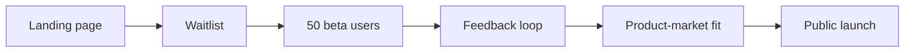
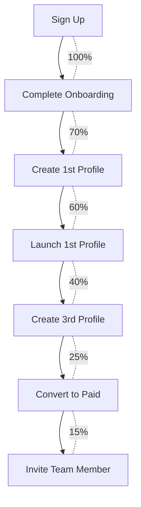

# 11. Estratégia de Crescimento SaaS — Polaris Browser

---

## Posicionamento

**Polaris Browser** = "O Linear dos gerenciadores de perfis de navegação."

| Atributo | Polaris | Concorrentes tradicionais |
|----------|---------|--------------------------|
| UX | Moderna, minimalista | Datada, complexa |
| Preço | R$ 29,90 entry | $30-100+ USD |
| Cloud sync | Nativo | Add-on ou inexistente |
| Automação | Webhooks + API | Limitada |
| Mercado | pt-BR first | Global EN only |
| Onboarding | 5 min to value | Manual, confuso |

---

## ICP (Ideal Customer Profile)

### Primário: Agências de Marketing Digital

- **Tamanho:** 3–20 pessoas
- **Dor:** Gerenciar 20–100 contas de ads/social com perfis isolados
- **Willingness to pay:** Alta (ROI claro)
- **Canal:** LinkedIn, comunidades de marketing, YouTube

### Secundário: E-commerce Multi-loja

- **Tamanho:** 1–5 operadores
- **Dor:** Múltiplas lojas/marketplaces com sessões separadas
- **Willingness to pay:** Média-alta
- **Canal:** Comunidades Shopify/ML, fóruns e-commerce

### Terciário: Equipes QA / Automação

- **Tamanho:** 2–10 QAs
- **Dor:** Ambientes isolados para testes cross-browser
- **Willingness to pay:** Média
- **Canal:** GitHub, Discord dev communities

---

## Go-to-Market (GTM)

### Fase 1: Beta Fechado (Mês 1–3)

| Ação | Detalhe | Meta |
|------|---------|------|
| Landing page | polarisbrowser.app — waitlist + value props | 500 signups |
| Beta fechado | 50 users selecionados (agências) | 50 active |
| Feedback | Weekly calls + in-app feedback widget | NPS > 30 |
| Iteração | 2-week sprints baseados em feedback | 3 pivots max |
| Case study | 1 beta user como case publicável | 1 publicado |

### Fase 2: Launch Público (Mês 4–6)

| Canal | Tática | Budget/mês |
|-------|--------|------------|
| Product Hunt | Launch day + hunter network | R$ 0 |
| SEO/Content | Blog: "como gerenciar perfis", "proxy para ads" | R$ 2.000 |
| YouTube | Tutoriais + reviews de influencers marketing | R$ 5.000 |
| LinkedIn | Posts orgânicos + ads targeting agências | R$ 3.000 |
| Comunidades | Discord, Telegram grupos de marketing/ads | R$ 0 |
| Afiliados | Recruit 10 micro-influencers marketing | R$ 0 (comissão) |

**Meta Mês 6:** 200 paying customers, MRR R$ 6.500.

### Fase 3: Scale (Mês 7–12)

| Canal | Tática | Budget/mês |
|-------|--------|------------|
| Paid ads | Google "gerenciador perfis navegador", Meta lookalike | R$ 8.000 |
| Partnerships | Integrações Zapier/Make marketplace listing | R$ 1.000 |
| Webinars | "Multi-conta segura para agências" mensal | R$ 500 |
| Referral program | "Indique e ganhe 1 mês grátis" | R$ 2.000 |
| Enterprise outbound | LinkedIn Sales Navigator → agências 20+ | R$ 3.000 |
| Conference | Stand em eventos marketing digital BR | R$ 5.000 |

**Meta Mês 12:** 500 paying customers, MRR R$ 19.000.

---

## Product-Led Growth (PLG)

### Activation Metrics

| Milestone | Target conversion | Ação se abaixo |
|-----------|-------------------|----------------|
| Signup → Onboarding | 70% | Simplificar step 1 |
| Onboarding → 1st profile | 60% | Templates pré-configurados |
| 1st profile → 1st launch | 80% | Botão launch mais proeminente |
| 1st launch → 3rd profile | 40% | Email D1: "Crie mais perfis" |
| 3rd profile → Paid | 25% | Trial expiring notification |
| Paid → Team invite | 15% | In-app prompt após 7 dias |

### Viral Loops

| Loop | Mecanismo | K-factor |
|------|-----------|----------|
| Workspace invite | Membro convidado → cria conta | 0.3 |
| Referral program | 1 mês grátis por indicação | 0.2 |
| Export/import | Perfil compartilhado → novo user importa | 0.1 |
| **Total K** | | **0.6** |

Target K > 0.5 para crescimento orgânico sustentável.

---

## Content Marketing

### Pillar Content (SEO)

| Pilar | Keywords target | Artigos |
|-------|----------------|---------|
| Perfis de navegação | "gerenciador de perfis chrome", "multi login browser" | 5 |
| Proxies | "proxy para marketing digital", "proxy rotativo" | 5 |
| Automação | "automação perfis navegador", "webhook browser" | 3 |
| Comparativos | "polaris vs multilogin", "alternativa anti-detect browser" | 3 |
| Tutoriais | "como gerenciar contas facebook ads", "multi conta instagram" | 5 |

**Total:** 21 artigos no primeiro ano → ~5.000 visitas orgânicas/mês.

### YouTube Strategy

| Tipo | Frequência | Exemplo |
|------|------------|---------|
| Tutorial | 2/mês | "Como criar 50 perfis em 5 minutos" |
| Comparison | 1/mês | "Polaris vs Concorrente X" |
| Use case | 1/mês | "Agência que escala com Polaris" |
| Product update | 1/release | "Novidades V2" |

---

## Retention Strategy

### Reduzir Churn

| Fase | Ação | Impacto esperado |
|------|------|-----------------|
| Pre-churn (D-7) | Email: "Seus perfis serão arquivados" | -10% churn |
| At-risk detection | Health score < 30 → CSM outreach | -15% churn |
| Win-back (D+30) | Email com cupom VOLTA30 | +5% reactivation |
| Annual push | D+60 mensal → oferta anual | -20% churn |
| Feature adoption | In-app tips para features não usadas | +10% engagement |

### Expand Revenue

| Trigger | Ação | Revenue impact |
|---------|------|---------------|
| 8/10 perfis | Upgrade prompt Starter→Unlimited | +R$ 20/mês |
| 3/3 membros | Upgrade prompt | +R$ 20/mês |
| API usage > 80% | Upgrade ou overage | +R$ 10/mês |
| Enterprise inquiry | Sales call | +R$ 500/mês |

**Net Revenue Retention target:** > 110%

---

## Competitive Moat

| Moat | Detalhe | Tempo para copiar |
|------|---------|-------------------|
| UX superior | Design Linear-level | 6 meses |
| pt-BR first | Suporte, docs, pricing local | 3 meses |
| Cloud sync nativo | Offline-first architecture | 9 meses |
| Automação ecosystem | API + Zapier + Make | 6 meses |
| Community | Base conhecimento + fórum | 12 meses |
| Data network | Proxy health database | 12 meses |

---

## Milestones de Crescimento

| Milestone | MRR | Clientes | Timeline | Ação |
|-----------|-----|----------|----------|------|
| 🌱 Seed | R$ 1.000 | 30 | Mês 3 | Validate PMF |
| 🌿 Sprout | R$ 5.000 | 150 | Mês 6 | Public launch |
| 🌳 Growth | R$ 15.000 | 400 | Mês 9 | Hire marketing |
| 🚀 Scale | R$ 30.000 | 800 | Mês 12 | Raise seed round |
| 🏔 Summit | R$ 100.000 | 2500 | Mês 24 | Series A ready |

---

## Fundraising Strategy (Opcional)

| Round | Timing | Valor | Use of funds |
|-------|--------|-------|-------------|
| Bootstrap | Mês 0–6 | R$ 0 | MVP com equipe enxuta |
| Angel/Pre-seed | Mês 9 | R$ 500k | Marketing + 2 hires |
| Seed | Mês 18 | R$ 2M | Scale + Enterprise |
| Series A | Mês 30 | R$ 10M | LATAM expansion |

**Métricas para Seed:** MRR R$ 30k+, churn < 5%, NRR > 100%, 800+ customers.

---

## Expansão Geográfica

| Fase | Mercado | Adaptação |
|------|---------|-----------|
| MVP | Brasil (pt-BR) | Pricing BRL, suporte PT |
| V2 | LATAM (es) | Tradução ES, pricing USD |
| Enterprise | US/EU | Pricing USD/EUR, GDPR, SOC2 |
| Long-term | Global | Multi-currency, 10+ idiomas |

---

## KPIs Dashboard (Review Semanal)

| Categoria | Métrica | Target semanal |
|-----------|---------|---------------|
| Aquisição | New signups | +25 |
| Aquisição | Trial starts | +20 |
| Ativação | Onboarding completion | > 70% |
| Receita | New MRR | +R$ 500 |
| Receita | Upgrades | +3 |
| Retenção | Churn | < 5 |
| Retenção | NPS | > 40 |
| Produto | DAU/MAU | > 40% |
| Produto | Feature adoption (proxy) | > 30% |
| Suporte | Tickets resolved < 24h | > 90% |

---

## Riscos de Crescimento

| Risco | Probabilidade | Impacto | Mitigação |
|-------|--------------|---------|-----------|
| Concorrente copia UX | Alta | Médio | Velocidade de iteration + community |
| Chrome muda API profiles | Média | Alto | Abstração BrowserEngine + fallback |
| Regulação proxies | Média | Alto | Terms of use claros, use cases legítimos |
| Churn alto pós-trial | Alta | Alto | Activation optimization + annual push |
| CAC too high | Média | Médio | Focus PLG + afiliados + SEO |
| Dependência Stripe | Baixa | Médio | Abstração PaymentProvider |

---

## Resumo Executivo

1. **Mercado:** Gerenciamento de perfis de navegação — nicho B2B em crescimento com operadores digitais no Brasil
2. **Diferencial:** UX moderna + pricing acessível + pt-BR first + cloud sync nativo
3. **GTM:** Product-led growth com beta fechado → launch → scale via content + afiliados
4. **Monetização:** SaaS subscription R$ 29,90–49,90/mês, margem bruta > 93%
5. **Meta 12 meses:** 500 clientes, MRR R$ 19.000, break-even path claro
6. **Moat:** UX + ecosystem + community + data network
7. **Expansão:** LATAM → Global com Enterprise tier
